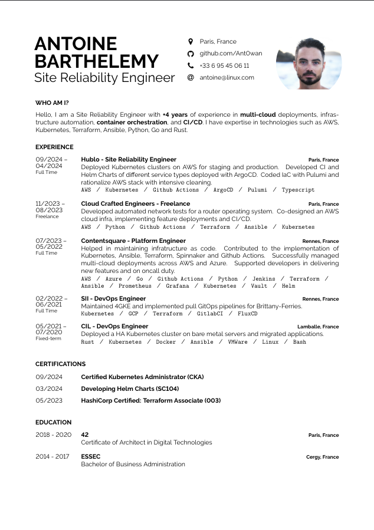

<br />
<p align="center">

  <h1 align="center">CV</h1>
  <p align="center">A curriculum vitae template in LaTex.<i></i>
  <p align="center">
  
  </p>
</p>


<p align="center">

</p>

---

## Prerequisite

If you are using a Debian's family linux distro.

```shell
apt-get install texlive-latex-base texlive-fonts-recommended texlive-fonts-extra texlive-latex-extra
```

otherwise, if rpm based,

```shell
dnf install texlive-scheme-full
```


## Build

In order to build a .pdf of your CV, enter the following in your terminal at the project root directory.

```shell=
make
```

then open the freshly created `cv.pdf` with your web browser.

```shell
firefox cv.pdf
```
